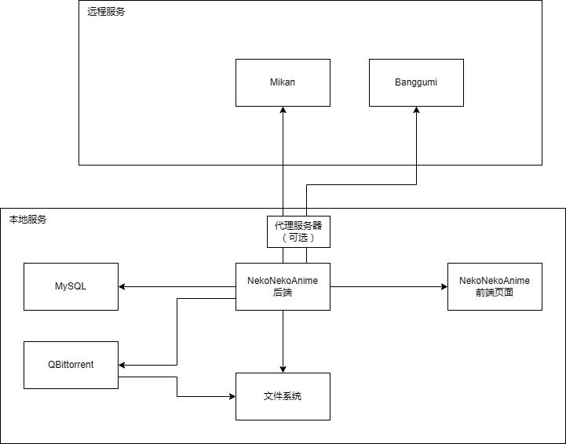

# NekoNekoAnime

一个用于自动追番和在线观看的开源项目

因为不会安装和配置autoBanggumi而编写了本项目，在未来会添加别的小功能到网站上  ~~我的网站我做主~~

~~不知道前端是啥 整个项目应该包含了前端罢(心虚)~~

## 安装

0. 使用Windows系统
1. 安装Node.js 添加到环境变量
2. 克隆本存储库到本地
3. cd到当前目录 使用`npm install`初始化项目依赖
4. 将index-example.js重命名为index.js
5. 安装XAMPP 并启用Apache和MySQL
  1. 进入http://localhost/phpmyadmin/index.php?route=/server/privileges&adduser=1
  2. 创建一个新的账户 并勾选`创建与用户同名的数据库并授予所有权限`(如果你清楚自己在做什么也可以自己创建数据库) 
  3. 修改index.js里数据库相关配置 可以搜索`dbConfig`, `user`和`database`为创建时的用户名, `password`为创建时的密码
6. 安装QBittorrent并运行 进入设置
   1. WebUI -> 勾选 `Web 用户界面(远程控制)`
   2. WebUI -> 验证 -> 勾选 `对本地主机上的客户端跳过身份验证`
   3. 如果修改了端口请在index.js里设置`qbittorrentConfig.host`为对应的地址和端口
7. 下载ffmpeg 如果没有设置ffmpeg为全局变量 请在index.js里设置`ffmpegPath`为ffmpeg的路径(最好不要有中文或者空格)
8. 修改index.js里其他的设置
   1. `proxyConfig` 请改为自己的代理服务器地址 (因为mikan被墙 bgm国内也不稳定 所以这两个都走的代理)
   2. `animePath` 修改为想要存放动漫视频文件的位置
   3. `ffmpegEncoding` 选择合适的一项取消注释
   4. `SSLOptions` 如果要使用https请设置证书
9. cd到当前目录 使用`Node index.js`启动
10. 如果要公开服务器请将index.js里的`defaultUserPerm`调为0并重启服务器

## 使用

### 添加动漫

1. 打开127.0.0.1:3000 使用管理员账号登录或注册 (在未修改`defaultUserPerm`的情况下注册的账号都为管理员账号)
2. 进入动漫控制台(/animeconsole)
3. 在添加动漫里搜索动漫关键字
4. 查看全部未绑定字幕组的动漫 -> 更新 为动漫绑定字幕组
5. 如果需要自动更新 需要为动漫绑定自动下载种子的正则表达式
   1. 查看全部未绑定种子正则的动漫 -> 更新
   2. 输入需要匹配的正则表达式
      - 后面称这个正则为`匹配种子的正则`
      - 一般只用把集数改为`\d+`即可 特殊的 有的字幕组会加上`v2` `END`等 此时可以只填写`.*简体.*`这种能表现区别的正则即可
   3. 回车保存
   4. 种子添加后会保存在种子数据库 满足条件的种子状态会被设为-1 
   5. 每天4:00 12:00 20:00 会自动更新文件数小于总集数的动漫的种子 并把满足条件的状态设为-1 称为更新全部动漫的种子文件
6. 开始下载未下载的种子 会将状态为-1的种子添加到qbittorrent
   - 本功能会在更新全部动漫的种子文件之后自动执行
7. 更新种子下载进度暂时无实际效果
   - 本功能30分钟执行一次
8. 更新文件 用于检查下载的文件是否已完成 并对非h264或者带有外挂/内嵌字幕的视频进行转码 之后添加进数据库
   - 本功能30分钟执行一次 如果上一次任务未完成则会跳过

### 管理单个动漫
1. 使用管理员账号登录
2. 进入动漫列表(/animeindex)
3. 进入要管理的动漫
4. 管理 板块用于控制视频文件是否展示
5. 全部种子 板块 
   - 输入框用于控制`匹配种子的正则` 
   - 更新 用于查看该动漫(该字幕组) 所有的种子 并查看状态和下载进度
   - 更新后 使用加号按钮将该种子状态设为-1 (会在30分钟以内自动下载 也可以用动漫控制台的开始下载未下载的种子 直接开始下载)
6. 别称 用于检索动漫 后面的刷新按钮会自动从banggumi获取别称

## 特性

- 保留所有原始文件并使用qbittorrent做种
- 想到再写

## TODO

[未完成] 一起看功能
[未开始] 优化用户权限
[无计划] 多平台

## 许可证

本项目使用 MIT 许可证

